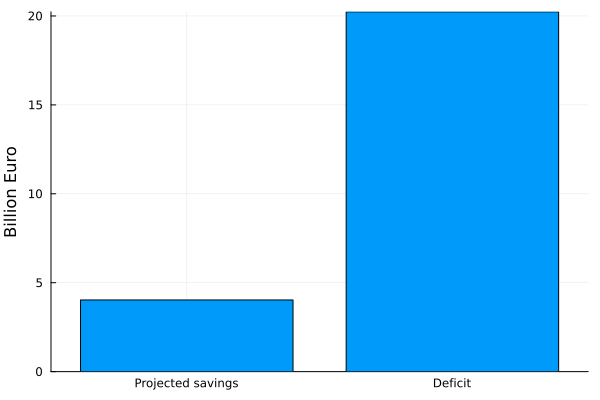

Some people would have you believe that scaling back the government would save us soo much money that we could all afford a private jet.

In reality [we have seen](../expenditure/government.md#greedy-government) that while the government wastes disproportionally per capita, it's not **that** significant. If we trust the efficiency per capita metric proposed there, we can simulate how much money we would save if we got down to the level of another country.

--8<-- "assets/government_saving.txt"

To put it into perspective - this is how it compares to the deficit

A significant saving to be sure, not very realistic with all complications in Belgium, but not enough to get us to a net surplus. 