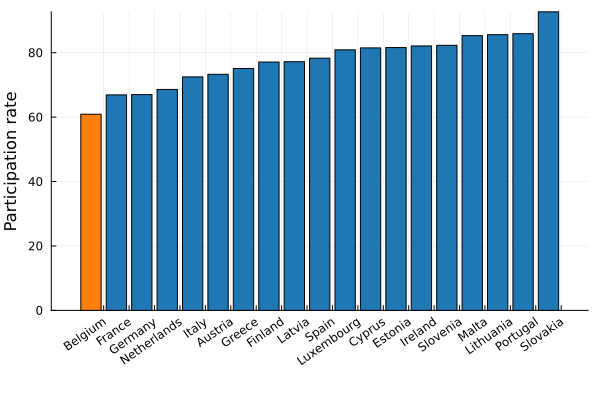
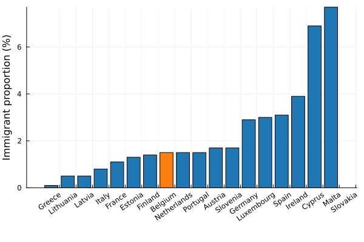

On the left of the political spectrum you can find people claiming that immigration enriches our culture. That our country barely functions - were it not that immigrants were jumping at jobs that would otherwise remain unfilled.

On the right it has been said that immigrants are actively destroying our culture, are making our cities unsafe and that our current immigration policy is financially untenable. There is a typical "story" of immigrants coming in just to profit from social welfare.

## Immigrant labour market outcome

Let us start by looking at the participation rate - this is the percentage of people that are unemployed but are actively seeking a job, or are already employed. I have selected non-european immigrants in the age bracket from 25 to 64 years old.

Yikes. Through whatever set of confounding factors, Belgium has managed to outperform every other country.

There are a lot of possible factors for this such as racism, a rough job market, a lenient immigration policy,.... But at the end of the day, if we cannot organize ourselves in such a way that the people who come here are those who want to work - and are then actually able to find work - then what are we doing?

It is a well documented fact that wealth inequality is a driving factor for crime and introducing an entire population group that is less likely to work **will** drive more crime. In turn it will fuel racism which negatively influences job opportunities. Something must structurally change.

## Number of immigrants

The following plot shows the size of the non-european immigrant population compared to the total Belgian population.

We are far from overflowing with immigrants but we are failing at integrating those that do come. It is important to get this right, not just with an eye on lowering crime, but also with an eye on [future pensions](pensions.md#the-dependency-factor).