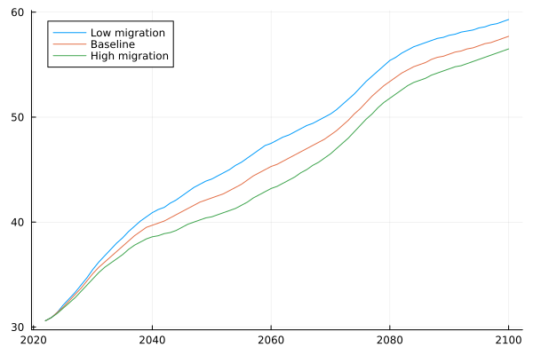

I have often heard it said that we won't have enough money to fund future pensions. We cannot increase wage taxation even further, and must come up with some radically new idea. We have [already](../expenditure/social_protection.md#old-age) seen that Belgium isn't all that remarkable when it comes to elderly care expenditure, so to what extend is this claim correct?

The short answer is [yes](https://www.nbb.be/doc/ts/publications/economicreview/2023/ecorevi2023_h09.pdf) - we're screwed. Even if we only take into account pension expenditure over gdp, that is projected to rise by 2%. That does not mean the end of the world, but one way or another we'll have to save on pensions. In the rest of this page I will do a poor attempt at sketching the magnitude of the problem, but you really ought to be reading the linked paper or even [the aging rapport](https://economy-finance.ec.europa.eu/publications/2024-ageing-report-economic-and-budgetary-projections-eu-member-states-2022-2070_en) for Belgium.

## The dependency factor

The dependency factor is defined as the number of people over the age of 65 divided by the number of working age persons. EUROSTAT provides forecasts of this number under different levels of migration.

It is the dependency factor that tells us how many people we will be able to tax to fuel this horde of old people.

A naive model would be to assume that both the expense per pensioner and revenue per worker scale similarly. In that case, you would need taxation to grow proportionally to the dependency factor, so +- 45% by 2060. The European commission suggests three main components that will be driving the pension costs down:

### The benefit ratio

The first of which is the benefit ratio - the ratio of the average pension to the average wage. In other words - old people will get smaller pensions.

### The coverage ratio

Old people will work for longer, thereby partially negating the need to give them pensions.

### The labour market effect

We will be able to enable more people to join the labour market. 

## A word of caution

While it looks bleak, these models need to be taken with a grain of salt. For one, it is very difficult to predict how the GDP will scale with respect to wages. A graying population will induce further changes in the economy, that will be harder to predict. 

Whatever happens, I would start saving up.