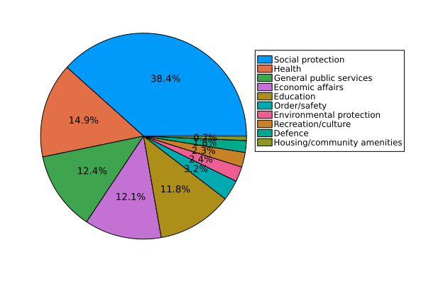
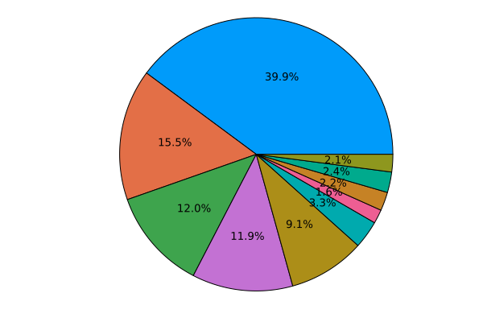

This is the breakdown of belgian spending

Compared to the European average

There are some tiny differences such as underspending on social protection, health, defence and housing. We are spending comparitively more on public services, education and environmental protection.

While interseting, the necessary budget should really be a function of your country's specific demographic makeup and geography.