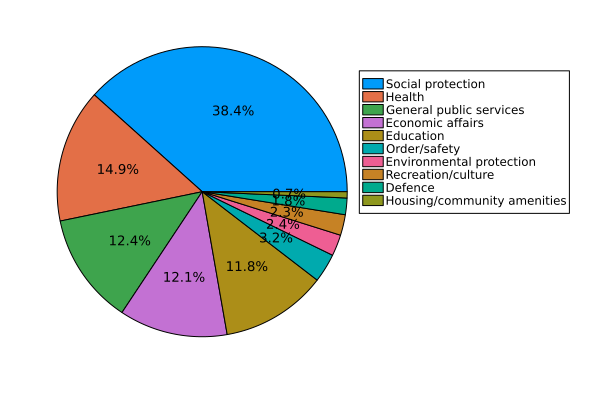

This is the breakdown of belgian spending

Compared to the European average

We spend proportionally less on general public services, education, order/safety, defence and housing/community amenities. We spend signficantly more on social protection and a little bit more on health, economic affairs, environmental protection and recreation/culture.
