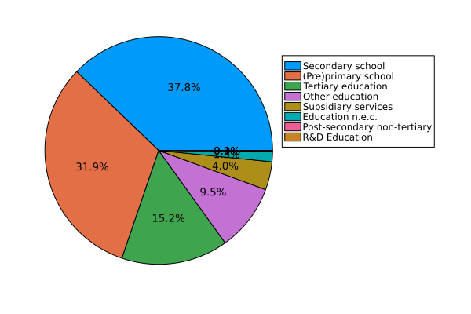
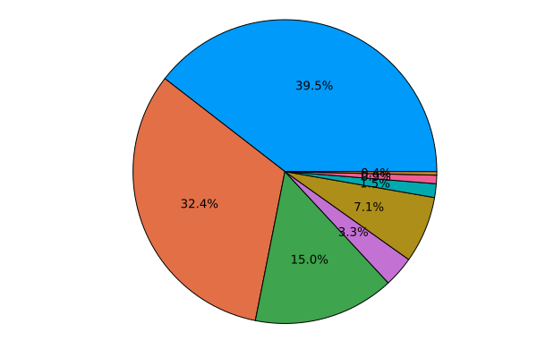
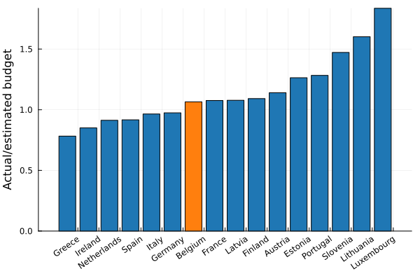
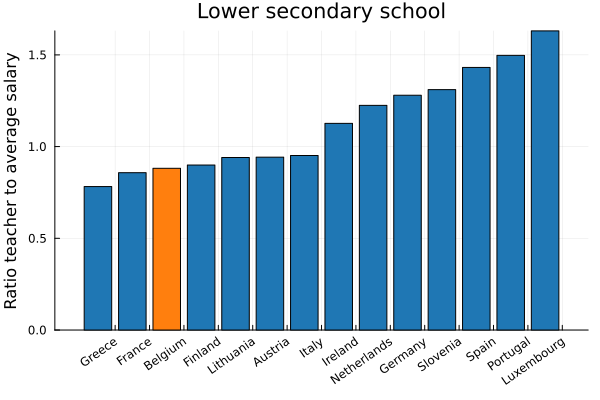

Our education expenditure:

is proportionally in line with the rest of the European union:

We spend significantly more on "Other education".

## Spending by type of education 

We can once again estimate a sensible budget by looking at student enrollments and comparing with different European countries. For both primary education : 

And secondary education

We find Belgium to be rather typical - neither over nor underfunded. Tertiary education is subdivided in a lot of different levels (bachelor, master, phd, short-cycle-tertiary), where most countries have incomplete measurements. The different levels make it difficult to analyze consistently and the lack of complete data makes it not very useful. Presumably Belgium is once again typical.

## Teacher salaries

One dimension that isn't clear from the previous plots are the actual teacher salaries. In the following plot I have compared the salary of a teacher in lower secondary general education (15 years of experience) to the average wage.

Teachers are notoriously difficult to come by, and the previous plot already shows one glaring problem - the wage is not atractive. Yet that alone is not enough to understand why the level of our students is plumetting. Finland scores consistently amongs the best in the world, while there is hardly a difference in salary.

