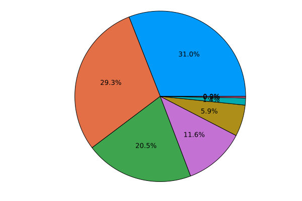
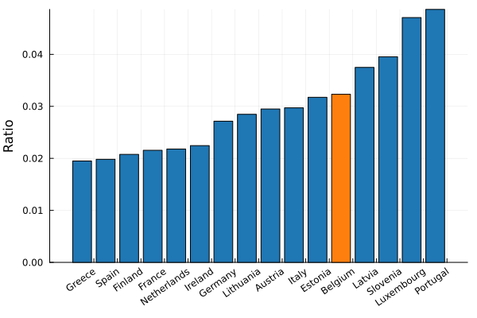
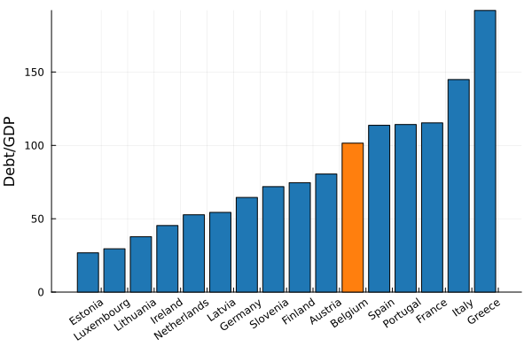

We are governed by 6 different governments, and they are often accused of eating up an exorbitant amount of money. Let's see where our "general public services" money is going!

Compared to the average European country

We have slightly more going to public debt, spend a proportionally larger amount on research, but proportionally way less on "Executive and legislative organs, financial and fiscal affairs, external affairs" (which I had to relabel to "Greedy government" on the plot, as to make it fit on the figure).

## Greedy government

Government cost should scale with the amount of people living in the country and in some natural money/person unit, which I again take to be the net average wage. The resulting linear model has an r2 score of 
--8<-- "assets/government_r2.txt"

We can therefore use this scale to compare the total budget with

Once again we find the typical belgian story. Above average, but not an outlier.

## Debt

We have quite a bit of debt, sometimes described as "crippling" - but is it so? To start with, let's compare our debt/gdp to other countries.

Because of our above average debt, we do have to spend a slightly more than most other countries.

