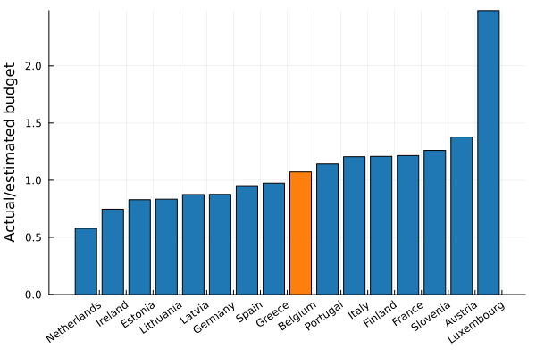
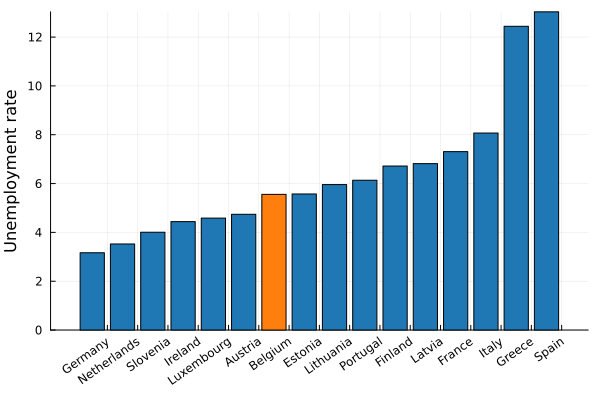

The typical country spends the majority of its social protection budget taking care of the elderly, and belgium is no exception:

While the average country spends its social protection budget the following way:

## Old age

We can roughly estimate a reasonable budget for elderly care - just give everyone older than 65 years the average net wage. I don't claim that this is what countries should be doing, but it should give a money scale to which we can compare the elderly-care budget. A linear fit gives an r2 score of
--8<-- "assets/old_age_r2.txt"

The ratio of the actual budget with respect to the estimated linear-model budget gives a notion of reasonableness.

We are fairly average (unlike the lonely outlier, everyone's favourite gas station, Luxembourg). If a lot of money is going towards taking care of the elderly, it appears to be because we have a lot of old people, not because we spend disproportionally more.

## Unemployment

Unemployment often gets thrown around as a big money sink. It is indeed not insignificant - but is it disproportional? To answer this, we need to first compare our country's unemployment rate against the rest of the european union, and then estimate whether the unemployment budget is in line with the number of unemployed people.

Very nicely around the european average! Even if it was high, it is a good thing not to be forced to take a job lest you be pushed into poverty. One would therefore expect that higher unemployments benefits should correlate with higher short term unemployment rate, which doesn't mean that people are taking malicious advantage of this system.

We can now allocate a reasonable budget by multiplying the amount of unemployed people by the average net take home pay. This scale should help us understand the reasonableness of our unemployment budget. 

We are fairly generous with unemployment benefits, very comparable to Finland, Austria and France.

## Sickness and disability

I found it difficult to find data on the amount of sick or disabled people. 

Eurostat provides data on the disability rate, but that also includes people that go to work and are not fully dependent on welfare. Belgium is very much towards the lower end of the spectrum.

There is data on the amount of people outside the workforce, but that also includes long term unemployed people and students. You could argue that the amount of sick/disabled people should be a constant fraction of the population, but the lack of benefits could force some people back into the workforce. 

All caveats aside, I fit a linear model on 

- total population times the average net takehome pay
- population outside the workforce times the average net takehome pay

The resulting fit has an R2 score of 
--8<-- "assets/disability_r2.txt"
If the predicted value deviates significantly from the actual budget, then we can use that as an indicator that we are spending more than typical.

It doesn't capture the entire story, but it appears as if we are spending more than expected, given our population numbers and amount of people outside the workforce.