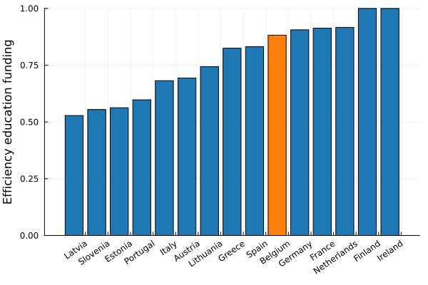
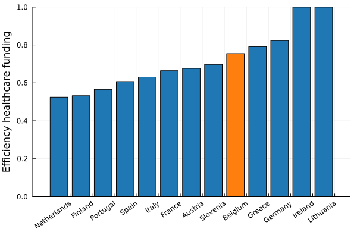

Perhaps one of the most important questions we could ask is - how efficiently does the government spend money? As in - are we getting something that is proportionally in return to the amount of taxation? To answer these questions, we will make use of [DEA](https://en.wikipedia.org/wiki/Data_envelopment_analysis).

## Education

I will make use of the PISA scores that students from different countries achieved on the three tested subjects : mathematics, reading and science. We've [already seen](../expenditure/education.md#spending-by-type-of-education) that the cost per student for pre-primary-education has to be estimated, despite being a sizeable fraction of the budget. 

That caveat aside, we can calculate the per-student investment over 9 years of pre-primary + primary school and 4 years of secondary education (until the time of testing). This budget will then be compared to our pisa rankings, and should estimate the efficiency of our education. 

I normalize the per-student spending by the median gross wage before taxes, as the main expenditure will be teacher salaries. That is not entirely fair as there is also building maintenance, learning material costs, ... but I believe it is sufficient to get the point accross. If we have a wasteful education system, it should already be apparant form this analysis.

We find a relatively well functioning education system! We can always do better by taking inspiration from Finland, Ireland or even our neighbours to the north. These conclusions remain unchanged when controlling for parental education levels, which is known to correlate well to the student's pisa score.

## Healthcare

Healthcare is difficult to score. Commonly used metrics make use of life expectancy, but that is not entirely fair. When I was little, I underwent some kind of corrective eye surgery. While that must have cost the government some amount of money, I have a hard time imagining that that would influence life expectancy in a meaningful way. There are a ton of confounding factors such as worker conditions, diet, education, .... 

Take the following analysis with a grain of salt. As production input I took healthcare spending relative to the total gdp. As output I will look at the number of healthy life years at 65 and hospital beds per capita.

## Infrastructure

## ...