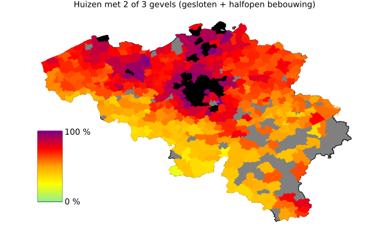
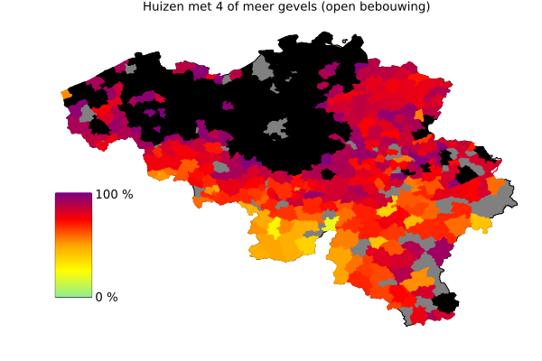

Given the high income tax, it is interesting to look at housing affordability. A natural metric is the average housing price to disposable income ratio.

This is great news - but must be taken with a grain of salt. To start with, it considers the average house, but prices fluctuate wildly across the country. We have previously seen that investing a lot into a career pays comparably less in Belgium, as wages are closer together. 

So the question is, how do more expensive houses compare higher salaries? How possible is it to work your way towards houses in a nicer neighborhood, and how does that compare to other countries? That data is not readily available, but EUROSTAT does provide a measure of overburden rate by degree of urbanisation. A household is overburdened when more than 40% of their disposable income is spent on housing.

We are not doing well in providing affordable housing in cities. Houses in the suburbs / towns / countryside are on the other hand affordable.

At least we're not in Greece?

## Housing affordability by muncipality

Statbel provides detailed statistics on the price of different types of houses per location. We can combine this with wage information of the median household to get a picture of where they would be able to buy a house.

--8<-- "assets/housing_budget_text.txt"

We can now plot the cost of a medium house per muncipality as a fraction of that budget. Muncipalities with missing data were marked in gray, while regions where the cost was outside our budget were marked in black.

