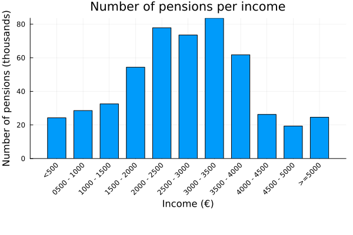
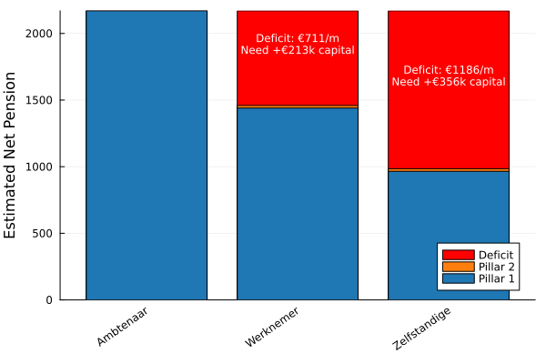

Our pension system consists of four different pillars:

- Statutory pension from the government
- Employer-offered pension plan
- Individual pension savings plan 
- Voluntary personal savings

The main pillar is the first one. Within that first pillar, there are different schemes. 

## Het ambtenarenpensioen

Governmental workers get a so called "ambtenarenpensioen", which is higher than non governmental employees. The reasoning was probably that a regular non-government employee would've been offered a higher salary and some extra pillar 2 contributions, but that that is compensated through a more luxurious pension.

It is sometimes mentioned that some governmental pensions workers are absurdly high, and that we ought to look there for significant savings. Luckily, that data can be found [online](https://www.sfpd.fgov.be/nl/kenniscentrum/statistieken)! In what follows, I will not be looking at the survivor-pension, a contribution you get when your partner passes away. I will only look at the individual "rustpensioenen".

This plot contains all people that worked for the government at some point.

## The proles

As mentioned before, this total ambtenarenpensioen should be compared to pillar 1 + pillar 2 of regular employees, and any further difference should be compensated by private savings enabled by your higher salary. Pillar 2 is complicated, you have the choice to get your accumulated reserves paid out through a monthly extra pension contribution or as a one time lump sum (after paying 3.55% RIZIV, 2% solidariteitsbedrag, 10% personenbelasting). This monthly contribution is fiscally less interesting but requires more planning to make sure we don't run out of reserves. It is - in my opinion - organized crime that people who are unable to properly plan out their expenses get again robbed by the state through a shitty monthly plan. It is no surprise that the vast majority (99%) take the lump sum.

There is a famous ['golden rule'](https://en.wikipedia.org/wiki/4%25_rule) for safe withdrawal during your pension - the 4% withdrawal rate. It states that you should start your first year with a withdrawal of 4% of your total reserves, and then withdraw the inflation adjusted correction of that amount in subsequent years. [We have data](http://www.pensionstat.be) on the average and median pillar 2 reserves for self-employed and employees, which we can combine with the 4% withdrawal rate and the average net pensions to estimate the effective difference in monthly income. Furthermore, we can then estimate how much money you would need to save to close that gap.

The plot below compares the median total estimated monthly pension income (Pillar 1 + 2) for different sectors. For pillar 1 I used data from pensionstat on the average pension, as the median and average should largely coincide (as it does with ambtenaren). For the pillar 2 reserves however, you can find the median reserves, which differ significantly (an order of magnitdue) from the average. In the following plot I used the median, as that is a better proxy for the 'typical person'. I looked at the accumulated reserves for workers aged 56-65, converted to a monthly annuity using the recommended 4% annual withdrawal rule.

