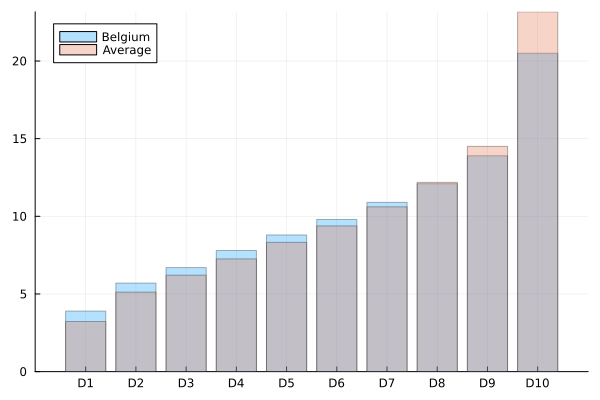

EUROSTAT provides a measure of equivalised income, where x% of that income makes you roughly equally rich everywhere. We can compare the breakdown of income into deciles in Belgium against the average breakdown of other countries

That shows quite clearly that our wage distribution is skewed towards the lower deciles. Less people make significantly above average. One could claim that this is a good thing - that high wage disparities would only drive higher class inequality. On the flip side, there are highly valued jobs that would be better compensated if you left Belgium. 

In practice we are unfortunately also measuring multiple other effects. Because of the high cost of labour, companies are incentivized to provide tax advantaged benifits to employee's. A very large chunk of this is that up until recently, everyone and their grandma got a company car. Such statistics do not show up in a decile wage distribution. 

High income individuals will often start a small company and pay themselves a relatively low wage. A lot of large expenses can be charged to their company, circumventing taxation, and after a few years they can start paying out money that lives on the company balance through tax advantaged rates (liquidatiereserve). There are no easily accessible public statistics on the amount of money that is paid out in this way.

Such a construction is not only fundamentally unfair, it is primarily accessible to people that already have an above average income.

