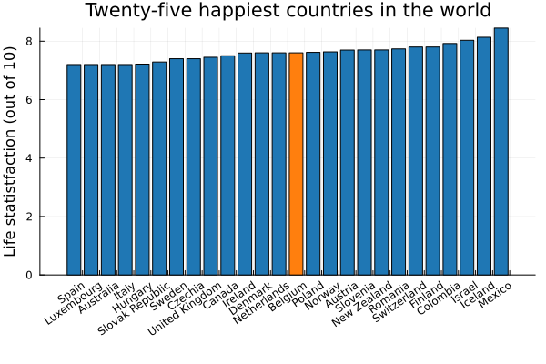

# A story of belgian (in)competence

Belgium has really high taxes for which we get a lot in return. The last time I visited the doctor I was asked to pay 3 euros and higher education is practically free. The state of our infrastructure (roads and public transportation) is above average and we are well protected against exploitation and poverty (though a lot of those protections are due to the european union). 

When asked about life satisfaction - the typical Belgian is clear - we are happy.

Nevertheless I have this feeling of inefficiency, the feeling that whatever we are getting is not proportional to the amount that we give back to the state. There is also a creeping suspicion that the middle class is bearing the bulk of the load, while not necessarily being the "strongest shoulders" (looking at you rich people!). Right wing populist parties go even further, suggesting that we are nearing financial (and moral) bankruptcy due to unchecked migration.

In this series of scripts I will try to understand whether this feeling is true. I will define taxation as all money the government takes from us and for which it promises great things in return - so it does include social security contributions.

## General information

The code to reproduce all plots, datasets and even the website can be found on github. Despite this transparancy, it is still possible for me to lie by omission. If I have twisted or misinterpreted the data, feel free to open an issue on github. 

I made this document for me, because I found it extremely difficult to 'cut through the noise' and form my own opinion. I turned it into a website because the markdown document became too long to navigate.

Most of my data is coming from the OECD. I will often make comparisons against "European countries", which are arbitrarily defined as the countries in the following list:

--8<-- "assets/compared_countries.txt"

## Revenue

In this section I will solely focus on government revenue. 

I will not focus on whether that money is being spent efficiently, but purely on how much money is getting extracted per working citizen and in what way. 

It is important to keep in mind that it may be unfair to compare the amount of taxation between different countries, as different countries provide different benefits to their citizens. Still, it is important to set the stage for the next chapter, where we shall look at how that money is being spend.

## Expenditure

To estimate whether expenditure is reasonable, we will start by breaking down the budget into the largest few categories. We will compare against the European average, and try to figure out to what extent we have a typical budget allocation.

Afterwards, we shall zoom in on different chunks of the pie, and try to understand their size using other demographic data such as the average wage or population count. That will allow us to compare parts of our budget between different countries, and should reveal if we are perhaps being overly generous with pensions or politician wages.

## Fairness

I will try to understand how effective our taxation policy is. How difficult is it to live, buy a house and save for the future. Are we socially mobile? Is our future outcome largely dependent on the wealth of our parents?

## Populist claims

In this section I will go over a few statements that I have read or heard being thrown around. I will try to measure to what extent they are (un)founded.