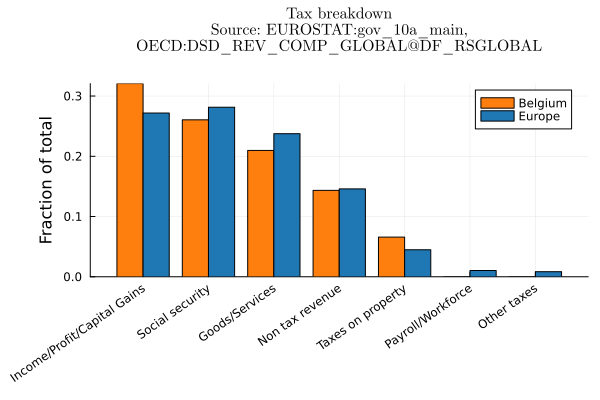
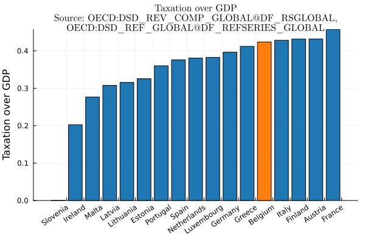
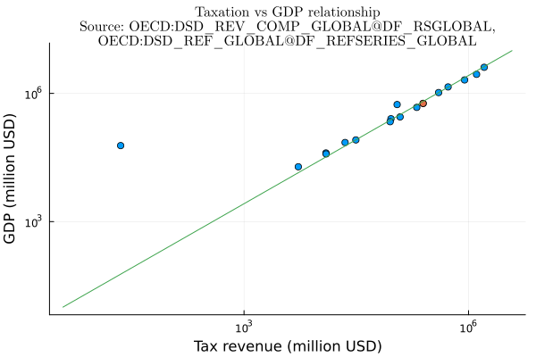

Revenue due to taxation can be split up in a number of factors. There is money being taken from corporations, there is VAT, import taxes, income tax,.... The following plot should give an idea on where that revenue is coming from.

 

We see that in Belgium, the fraction of revenue coming from income taxation is 5% higher, while less revenue is coming from the taxation of goods and services. The difference is not - as I have sometimes read online - in our social security.

## Comparing taxation revenue to GDP
You may have seen plots like the one below, where taxation revenue is compared to the GDP. Belgium is marked in orange indicator. 

We see Belgium on the high end, shouldered by Germany and Italy. Though our total taxation revenue does not appear remarkable by EU standards. That may surprise you - a lot of noise is being made about excessive taxation in Belgium, in relative terms that simply isn't true. 

One might wonder if the comparison of taxation to GDP is really fair. GDP is defined as the total market value of all final goods and services produced within a country's borders. It is a metric for the size of an economy, and so it makes sense that public expenditure (and therefore the required taxation) should scale in some way with the GDP - but must it really be linear? To answer that, let's look at a log-log plot for taxation against GDP. In green we show the average taxation revenue over gdp relationship.

The comparison seems roughly valid, except for Slovenia, where something is certainly wrong with the taxation statistics. It is notable that smaller economies tend to tax comparatively less while larger economies tend to tax comparitively more.
