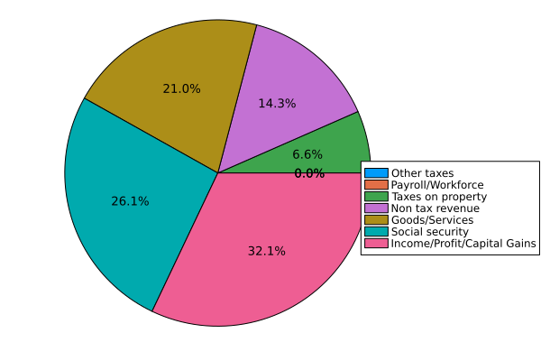
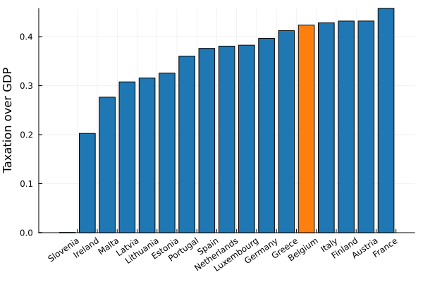

Revenue due to taxation can be split up in a number of factors. There is money being taken from corporations, there is VAT, import taxes, income tax,.... The following plot should give an idea on where that revenue is coming from.

 

This can be compard with the average breakdown of an European country.

We see that in Belgium, the fraction of revenue coming from income taxation is 5% higher, while less revenue is coming from the taxation of goods and services. The difference is not - as I have sometimes read online - in our social security.

## Comparing taxation revenue to GDP
You may have seen plots like the one below, where taxation revenue is compared to the GDP. Belgium is marked in orange indicator. 

One might wonder if that comparison is really fair. Is taxation typically proportional to GDP - as it probably should be? For example, does the presence of natural resources not skew that ratio? To answer that, let's look at a log-log plot for taxation against GDP. In green we show the average taxation revenue over gdp relationship.

The comparison seems valid, except for Slovenia, where something is most certainly wrong with the taxation statistics.

We see Belgium on the high end, shouldered by Germany and Italy. Though our total taxation revenue does not appear remarkable by EU standards.