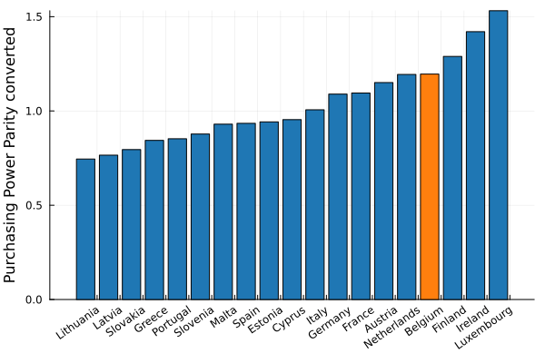

It is fair to say that belgium does indeed have a rather high taxation revenue, at least compared to other countries. Even when we take into account that a lot of this is going to social security, we're still one of the European leaders. Though importantly, we do not have a **disproportionate** amount of taxation revenue compared to the size of our economy. If we are feeling the effects of taxation then it seems to me that this is mostly because of the allocation, and not because of the magnitude.

It's notable that Belgium has decided to increase labour costs, while having a lower VAT. An everyday worker will very much feel the effects of increased labour costs by looking at the difference between his netto and brutto salary. Simultaneously we seem to be taxing companies (especially in the petrochemistry industry) to a smaller extent, which has a far more hidden effect. It should boost our economy and provide more economic growth (and therefore more jobs).

A lower salary is mostly annoying when trying to relocate, buying imported goods or when going on vacation. For everyday expenses, the metric to look at is the cost of consumer goods. If these are cheap, then a lower salary is less of a problem. Eurostat provides a consumer goods and services table, estimating in relative terms how expensive everyday consumer goods and services are. 

We find Belgium to be expensive. When people talk about how our purchasing power is protected despite the high taxation, I don't know what metric they are looking at.

Taxation on its own is not necessarily a bad thing - in the next section we will look at where that money is going, and whether that is in line with other countries.
