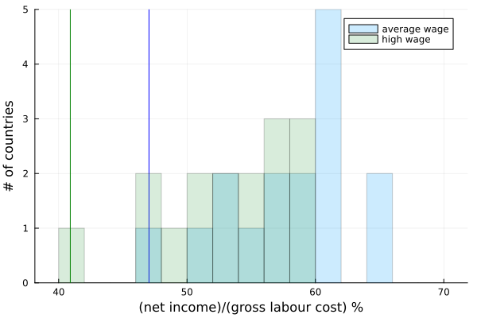

We have seen that Belgium has decided to lower the taxation on goods and services, while increasing taxation on income/revene. The effects are particularly clear when looking at the cost of labour. If an employer pays you X amount of money to do your work, how much does the government take away and how much eventually ends up in your bank account.

If we take a look at a single person househould with an average or high (167% of average) wage, then we can compare his/her net income vs the labour cost that was paid. While it wouldn't be difficult to spot belgium, I have nevertheless marked it with a line.

## A different vat policy

A significant fraction of taxation on goods and services is generated through the VAT tax. I simulated the effects of a different policy by looking at the import flow of goods into Belgium, and applying the VAT policy of different countries. We can use that to estimate the total revenue generated had Belgium changed its policy to that of a different country. I have plotted the results below, and indicated the actual (unsimulated) Belgian VAT revenue.

--8<-- "assets/vat_policy_change.txt"

It is of course an oversimplifications to suggest that we can simply change policies and not induce dramatic changes to import flow or purchasing power.

We can take a closer look at where this gain in revenue would come from, by breaking it down per category. Keep in mind that I have not included custom duties, only the VAT component. 

--8<-- "assets/vat_biggest_changes.txt"

We are using lower rates to appease our chemical, plastics and life sciences industry, the industrial pillar of our economy. The industry in turn supplies jobs and wages, which are then highly taxed.